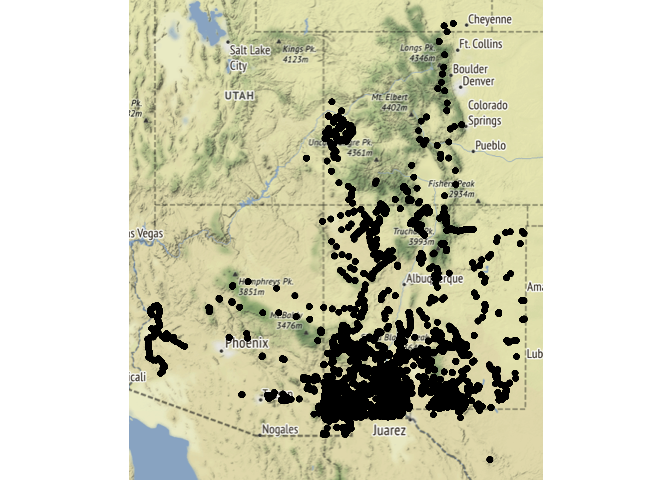

<!-- README.md is generated from README.Rmd. Please edit that file -->

# PatricksPlants

<!-- badges: start -->

<!-- badges: end -->

The goal of PatricksPlants is to make Patrick Alexander’s plant
occurance observations more accessible for analysis.

A data frame is provided with all observations and metadata coded as
presence-only. Presence-absence data may reasonably be infered from this
and a function will be provided to do so for a specified set of species
or for the entire dataset. Beware that presence-absence can get rather
large for cross-product of sites and plants in the dataset. At the time
of this writing, the presence-only data were around 10,000 rows, while
the presence-absence data were over 10,000,000 rows.

A function is provided for reading Patrick’s xlsx file, in which he
records his obsevations from his field notebook. The function returns a
data frame of presence-only or presence-absence with metadata for sites,
surveys, and plant taxonomy. The presence-only output is identical in
format to the supplied
dataset.

## Installation

<!-- You can install the released version of PatricksPlants from [CRAN](https://CRAN.R-project.org) with: -->

<!-- ``` r -->

<!-- install.packages("PatricksPlants") -->

<!-- ``` -->

You can install the development version of PatricksPlants from GitHub
with:

``` r
install.packages("devtools")
devtools::install_github("gregorypenn/PatricksPlants")
```

## Examples

Here are the locations in the dataset.

``` r
library(PatricksPlants)
library(ggplot2)

qmplot(longitude, latitude, 
       data = patricks_plants)
```



What’s the distribution of species counts across surveys?

``` r
species_richness <- patricks_plants %>%
  filter(area_approx == "10m radius") %>%
  group_by(survey_id) %>%
  summarize(plants = n())

ggplot(species_richness, aes(x = plants)) +
  geom_histogram(binwidth = 1) +
  theme_bw()
```


How many survey sites had *Bouteloua eriopoda*, and how many didn’t?

``` r
BOER4 <- presence_absence("BOER4", patricks_plants)
#> Joining, by = c("survey_id", "project", "allotment", "site", "date", "date_verbatim", "photographed", "area_approx", "latitude", "longitude", "elevation", "elevation_verbatim", "state", "county", "site_descriptions_and_comments", "ecological_site", "ecological_site_code", "herbicide_treatment_verbatim", "herbicide_treatment_year", "year", "herbicide_treated", "years_since_treatment", "LCDO_binary", "exclude_from_analyses", "statedirectory", "countydirectory", "exportmarker", "NSD", "NSD_comments", "image_1", "image_2", "image_3", "image_4", "image_5", "image_6", "image_7")
table(BOER4$presence)
#> 
#> FALSE  TRUE 
#>  3979  1082
```

<!-- Don't forget to commit and push figure files, so they display on GitHub! -->
