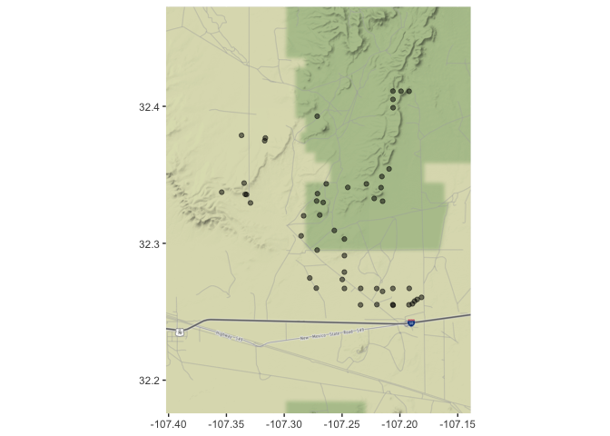
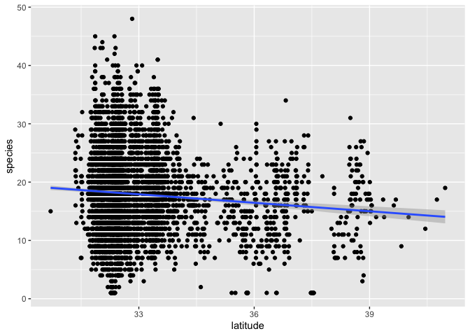

<!-- README.md is generated from README.Rmd. Please edit that file -->

# PatricksPlants

<!-- badges: start -->

<!-- badges: end -->

The goal of PatricksPlants is to make Patrick Alexander’s plant
occurrence observations more accessible for analysis.

A data frame is provided with all observations and metadata coded as
presence-only. Presence-absence data may reasonably be infered from this
and a function will be provided to do so for a specified set of species
or for the entire dataset. Beware that presence-absence can get rather
large for cross-product of sites and plants in the dataset. At the time
of this writing, the presence-only data were around 10,000 rows, while
the presence-absence data were over 10,000,000 rows.

A function is provided for reading Patrick’s xlsx file, in which he
records his obsevations from his field notebook. The function returns a
data frame of presence-only or presence-absence with metadata for sites,
surveys, and plant taxonomy. The presence-only output is identical in
format to the supplied dataset.

## Installation

You can install the development version of PatricksPlants from GitHub
with:

``` r
install.packages("devtools")
devtools::install_github("gregorypenn/PatricksPlants")
```

These two lines of code will download and install Patrick’s Plants and
all its dependencies.

## Package Status

This package is in early development. So far it contains little more
than a dataset, a function for importing a new dataset from an xlsx
file, and a function for creating presence-absence data for individual
species. If you’d like to collaborate with development, file bug
reports, or request features, please familiarize yourself with [Github’s
issue tracker](https://guides.github.com/features/issues/). I’m just
learning about it myself and it’s a pretty cool tool.

#### Bugs

There may be bugs. Please [file an
issue](https://github.com/gregorypenn/PatricksPlants/issues) if you find
one.

#### Feature Requests

[File an issue](https://github.com/gregorypenn/PatricksPlants/issues) to
request a new feature. Preface the issue title with “Feature request:”
and provide a detailed description of how you’d like it to work. Most
features will be implemented as functions, so start by describing the
inputs and outputs you’d like, then any options you’d like it to have.

## Examples

The examples in this section illustrate possible use cases with the
data. If there’s something you’d like to do that isn’t include here and
you can’t figure it out, let me know with a feature request and I’ll try
to help. If the task is simple, I’ll just add an example here. If it’s
more complex, I’ll simplify it for the user by providing new functions
that automate some tasks.

The blocks of code in this section are independently reproducible. Any
block, pasted into a fresh R session should produce the expected
results, provided you have the required packages installed. More on that
below.

*Note on packages and* `library`: Packages required to run the examples
are included in the example code. If you run something like
`library(ggplot2)` and get an error message, “there is no package called
‘gplot2’”, then you need to install the package using
`install.packages("ggplot2")`. Gotcha: package names are quoted for
`install.packages`, but not for `library`. Also, you only need to attach
a package with `library(package)` once per R session. That code is
repeated for each block on this page in order to make the blocks
independently reproducible.

### Summarizing

Summarizing is the task of aggragating information across categories.
For example, we may wish to summarize the set of plants that occur at a
set of sites. After specifying the sites, we’ll get

  - The union set of plants across the sites
  - The distribution of species across sites

Two methods for selecting sites are given below: a set determined by
allotment, and an arbitrarily specified set we’ll call `site_names`. The
code for the arbitrary list is commented out, so it won’t run unless
uncommented.

``` r
library(PatricksPlants)
library(dplyr)
library(ggplot2)

# Filtering data by allotment.
# The allotment id is quoted because it is coded as a factor
plants_surveyed <- patricks_plants %>%
  filter(allotment == "03009") %>%  # filter works on rows
  select(survey_id, plant_id) %>%   # select works on columns
  return(.)

# To see all records use print(plants_at_sites, n = nrow(plants_at_sites))
plants_surveyed
#> # A tibble: 955 x 2
#>    survey_id plant_id
#>        <int> <fct>   
#>  1      1395 AMAC    
#>  2      1522 AMPA    
#>  3      1523 AMPA    
#>  4      3830 AMPA    
#>  5       197 CHENO   
#>  6       198 CHENO   
#>  7      3830 CHENO   
#>  8      3895 KRLA2   
#>  9      3896 KRLA2   
#> 10       191 SATR12  
#> # … with 945 more rows

# If you want to filter by allotment and return results in a format similar to that of the original excel file, use this:
# plants_surveyed <- patricks_plants %>%
#   filter(allotment %in% "01001") %>%  # filter works on rows
#   select(species, plant_id, common_name, site) %>%   # select works on columns
#   return(.)
# sites <- patricks_plants %>%
#   filter(site %in% plants_surveyed$site) %>%
#   select(survey_id, site, date, latitude, longitude) %>%
#   return(.)
# plants_surveyed <- mutate(plants_surveyed, presence = 1)
# plants_surveyed <- pivot_wider(
#   plants_surveyed,
#   names_from = site,
#   values_from = presence,
#   values_fill = list(presence = 0))
# scols <- 4:ncol(plants_surveyed)
# plants_surveyed <- mutate(
#   plants_surveyed,
#   prop = rowsums(plants_surveyed[scols]) / (ncol(plants_surveyed) - 3))

# # Uncomment this code to run it instead of filtering by allotment
# # An arbitrary set of sites
# site_names <- c(
# "rough cr 1",
# "buckhorn 3",
# "hardcastle canyon 3",
# "wood cyn 3",
# "yeso hills 7")
# 
# plants_surveyed <- patricks_plants %>%
#   filter(site %in% site_name) %>%       # filter works on rows
#   select(survey_id, plant_id) %>%   # select works on columns
#   return(.)
# 
# To see all records use print(plants_at_sites, n = nrow(plants_at_sites))
# plants_surveyed

# Summarize species records by the proportion of sites where they occur
prop <- plants_surveyed %>%
  group_by(plant_id) %>%
  summarize(prop_sites = n() / length(unique(plants_surveyed$survey_id))) %>%
  arrange(desc(prop_sites))

prop
#> # A tibble: 154 x 2
#>    plant_id prop_sites
#>    <fct>         <dbl>
#>  1 BOBAB3        0.686
#>  2 DAPU7         0.667
#>  3 MUPO2         0.588
#>  4 ACNA2         0.549
#>  5 LATR2         0.549
#>  6 BAAB          0.529
#>  7 PLMU3         0.490
#>  8 ARAD          0.471
#>  9 ASNU4         0.431
#> 10 CRPO5         0.431
#> # … with 144 more rows

# Further summarize by proportion of species at proportion of sites
prop_x_prop <- prop %>%
  group_by(prop_sites) %>%
  summarize(prop_species = n() / length(prop$plant_id)) %>%
  select(prop_species, prop_sites) %>% # selecting in the order for display
  arrange(desc(prop_species))

prop_x_prop
#> # A tibble: 24 x 2
#>    prop_species prop_sites
#>           <dbl>      <dbl>
#>  1       0.279      0.0196
#>  2       0.143      0.0392
#>  3       0.104      0.0588
#>  4       0.0974     0.0980
#>  5       0.0649     0.137 
#>  6       0.0584     0.118 
#>  7       0.0325     0.0784
#>  8       0.0325     0.196 
#>  9       0.0195     0.157 
#> 10       0.0195     0.255 
#> # … with 14 more rows

dist_plot <- ggplot(prop_x_prop, aes(x = prop_species, y = prop_sites)) +
  geom_point() +
  xlab("Proportion of Species") +
  ylab("Proportion of Sites") +
  ggtitle("Distribution of Species Across Sites")

dist_plot
```


``` r

# You can save the plot to a file by uncommenting the following line.
# The filetype will be determined by the suffix you provide for the filename.
# ggsave(filename = "dist_plot.png", plot = dist_plot)
```

### Mapping

Gotcha: Stamen basemaps do not require any registration or payment, but
Google now requires a credit card to access their mapping API. They do
have a free usage tier that I have not yet exceeded. For instructions on
setting up the Google API with R, run `?ggmap::register_google`.

#### Point Locations

Maps can be generated for longitude-latitude point locations, as with
presence-only data.

``` r
library(PatricksPlants)
library(ggmap)

map_points(patricks_plants) +
  ggtitle("Patrick's Places")
```


We can select the set of points that we want for the map, for example
selecting by the allotment used in the example on summarizing. Note that
we’ve specified a `"terrain"` basemap here instead of the default
`"toner-lite"`.

``` r
library(dplyr)
library(ggmap)

sites <- patricks_plants %>%
  filter(allotment == "03009") %>%
  select(survey_id, latitude, longitude) %>%
  distinct() # This removes duplicate rows. There was a row for each plant-site.

map_points(sites, maptype = "terrain")
```



#### Presence-Absence Data

Presence-absence data differ from point location data in having the
attribute *presence*: TRUE or FALSE. The presence attribute is mapped to
the color of points.

``` r
boer4 <- presence_absence("BOER4")
map_presence_absence(boer4)
```


### Plotting

What’s the distribution of species counts across survey sites with 10m
radius?

``` r
library(PatricksPlants)
library(dplyr)
library(ggplot2)

species_10m <- patricks_plants %>%
  filter(area_approx == "10m radius") %>%
  group_by(survey_id) %>%
  summarize(species = n())

ggplot(species_10m, aes(x = species)) +
  geom_histogram(binwidth = 1) +
  theme_bw()
```


#### Modeling

Does biodiversity decrease with latitude? Patrick finds about 1 fewer
species for every 2 degrees north that he wanders (see estimate and
confidence interval in model summary below). Of course, the southern end
of his range does happen to be a biodiversity hotspot. The plot clearly
shows that Patrick needs to spend more time up north; notice the wider
confidence interval at higher latitudes.

``` r
library(dplyr)
library(ggplot2)

species_counts <- patricks_plants %>%
  filter(area_approx == "10m radius") %>%
  select(survey_id, latitude) %>%
  group_by(survey_id) %>%
  summarize(species = n(),
            latitude = mean(latitude))

ggplot(species_counts, aes(x = latitude, y = species)) + 
  geom_point() +
  geom_smooth(method = "lm")
```



``` r

model <- lm(species ~ latitude, data = species_counts)
summary(model)
#> 
#> Call:
#> lm(formula = species ~ latitude, data = species_counts)
#> 
#> Residuals:
#>      Min       1Q   Median       3Q      Max 
#> -17.2599  -4.8488  -0.4134   4.1259  30.0089 
#> 
#> Coefficients:
#>             Estimate Std. Error t value Pr(>|t|)    
#> (Intercept)  33.8961     2.3477  14.438  < 2e-16 ***
#> latitude     -0.4845     0.0710  -6.824 9.95e-12 ***
#> ---
#> Signif. codes:  0 '***' 0.001 '**' 0.01 '*' 0.05 '.' 0.1 ' ' 1
#> 
#> Residual standard error: 6.889 on 4757 degrees of freedom
#> Multiple R-squared:  0.009695,   Adjusted R-squared:  0.009487 
#> F-statistic: 46.57 on 1 and 4757 DF,  p-value: 9.949e-12
confint(model)
#>                  2.5 %     97.5 %
#> (Intercept) 29.2935176 38.4987831
#> latitude    -0.6237102 -0.3453252
```

<!-- Don't forget to commit and push figure files, so they display on GitHub! -->
