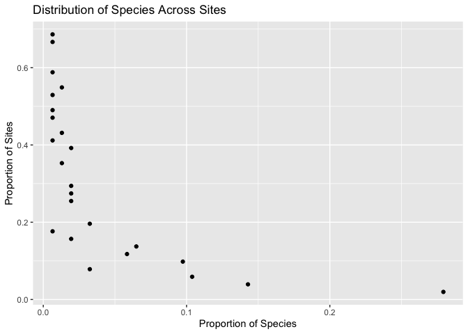

<!-- README.md is generated from README.Rmd. Please edit that file -->

# PatricksPlants

<!-- badges: start -->

<!-- badges: end -->

The goal of PatricksPlants is to make Patrick Alexander’s plant
occurance observations more accessible for analysis.

A data frame is provided with all observations and metadata coded as
presence-only. Presence-absence data may reasonably be infered from this
and a function will be provided to do so for a specified set of species
or for the entire dataset. Beware that presence-absence can get rather
large for cross-product of sites and plants in the dataset. At the time
of this writing, the presence-only data were around 10,000 rows, while
the presence-absence data were over 10,000,000 rows.

A function is provided for reading Patrick’s xlsx file, in which he
records his obsevations from his field notebook. The function returns a
data frame of presence-only or presence-absence with metadata for sites,
surveys, and plant taxonomy. The presence-only output is identical in
format to the supplied dataset.

## Installation

You can install the development version of PatricksPlants from GitHub
with:

``` r
install.packages("devtools")
devtools::install_github("gregorypenn/PatricksPlants")
```

These two lines of code will download and install Patrick’s Plants and
all its dependencies.

## Package Status

This package is in early development. So far it contains little more
than a dataset, a function for importing a new dataset from an xlsx
file, and a function for creating presence-absence data for individual
species. If you’d like to collaborate with development, file bug
reports, or request features, please familiarize yourself with [Github’s
issue tracker](https://guides.github.com/features/issues/). I’m just
learning about it myself and it’s a pretty cool tool.

#### Bugs

There may be bugs. Please [file an
issue](https://github.com/gregorypenn/PatricksPlants/issues) if you find
one.

#### Feature Requests

[File an issue](https://github.com/gregorypenn/PatricksPlants/issues) to
request a new feature. Preface the issue title with “Feature request:”
and provide a detailed description of how you’d like it to work. Most
features will be implemented as functions, so start by describing the
inputs and outputs you’d like, then any options you’d like it to have.

## Examples

*Note on packages and* `library`: Packages required to run the examples
are included in the example code. If you run something like
`library(ggplot2)` and get an error message, “there is no package called
‘gplot2’” then you need to install the package using
`install.packages("ggplot2")`. Gotcha: package names are quoted for
`install.packages`, but not for `library`. Also, you only need to attach
a package with `library(package)` once per R session. That code appears
repeatedly on this page to make each chunck of R code in the examples
indepently reprodicible.

### Mapping

Gotcha: Stamen basemaps do not require any registration or payment, but
Google now requires a credit card to access their mapping API. They do
have a free usage tier that I have not yet exceeded. For instructions on
setting up the Google API with R, run `?ggmap::register_google`.

#### Point Locations

Maps can be generated for longitude-latitude point locations, as with
presence-only data.

``` r
library(PatricksPlants)
library(ggmap)

map_points(patricks_plants) +
  ggtitle("Patrick's Places")
```


#### Presence-Absence Data

Presence-absence data differ from point location data in having the
attribute *presence*: TRUE or FALSE. The presence attribute is mapped to
the color of points.

``` r
boer4 <- presence_absence("BOER4")
map_presence_absence(boer4)
```


### Plotting

What’s the distribution of species counts across survey sites with 10m
radius?

``` r
library(PatricksPlants)
library(dplyr)
library(ggplot2)

species_10m <- patricks_plants %>%
  filter(area_approx == "10m radius") %>%
  group_by(survey_id) %>%
  summarize(species = n())

ggplot(species_10m, aes(x = species)) +
  geom_histogram(binwidth = 1) +
  theme_bw()
```


#### Modeling

Does biodiversity decrease with latitude? Patrick finds about 1 fewer
species for every 2 degrees north that he wanders (see estimate and
confidence interval in model summary below). Of course, the southern end
of his range does happen to be a biodiversity hotspot. The plot clearly
shows that Patrick needs to spend more time up north; notice the wider
confidence interval at higher latitudes.

``` r
library(dplyr)
library(ggplot2)

species_counts <- patricks_plants %>%
  filter(area_approx == "10m radius") %>%
  select(survey_id, latitude) %>%
  group_by(survey_id) %>%
  summarize(species = n(),
            latitude = mean(latitude))

ggplot(species_counts, aes(x = latitude, y = species)) + 
  geom_point() +
  geom_smooth(method = "lm")
```



``` r

model <- lm(species ~ latitude, data = species_counts)
summary(model)
#> 
#> Call:
#> lm(formula = species ~ latitude, data = species_counts)
#> 
#> Residuals:
#>      Min       1Q   Median       3Q      Max 
#> -17.2599  -4.8488  -0.4134   4.1259  30.0089 
#> 
#> Coefficients:
#>             Estimate Std. Error t value Pr(>|t|)    
#> (Intercept)  33.8961     2.3477  14.438  < 2e-16 ***
#> latitude     -0.4845     0.0710  -6.824 9.95e-12 ***
#> ---
#> Signif. codes:  0 '***' 0.001 '**' 0.01 '*' 0.05 '.' 0.1 ' ' 1
#> 
#> Residual standard error: 6.889 on 4757 degrees of freedom
#> Multiple R-squared:  0.009695,   Adjusted R-squared:  0.009487 
#> F-statistic: 46.57 on 1 and 4757 DF,  p-value: 9.949e-12
confint(model)
#>                  2.5 %     97.5 %
#> (Intercept) 29.2935176 38.4987831
#> latitude    -0.6237102 -0.3453252
```

<!-- Don't forget to commit and push figure files, so they display on GitHub! -->
